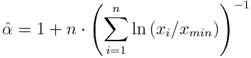

## Introduction

A variable x is said to obey a power-law if it is drawn from a probability distribution function (pdf) of the form *p(x) = Cx-&alpha;* where *C* is called the **normalization constant** and *&alpha;* is called **scaling parameter** or exponent. Often, the power-law applies only for values greater than some minimum *x*, called *xmin*. The paper describes various statistical techniques to test if a given distribution follows a power-law or not.

Power-law distributions come in both continuous and discrete flavor with the discrete case being more involved than the continuous one. So, the discrete power-law behavior is often approximated by continuous power-law behavior for the sake of convenience. One reliable approximation is to assume that discrete values of *x* are generated from a continuous power-law and then rounded to nearest integer to get the discrete values.

Sometimes, complementary cumulative distribution function (or CDF) is also considered where *P(X) = p(x ≥ X)* 

## Fitting power-laws to empirical data

Power-law distribution makes a straight line on  the log-log plot. This slope can be calculated using the method of least square linear regression. But simple line fitting does not guarantee that data follows a power-law distribution. Moreover, the assumption of independent, Gaussian noise, which is a pre-requisite for linear regression, does not hold for this case.

### Estimating scaling parameter

Assuming that we know the value of *xmin*, the value of *&alpha;* can be obtained by the *method of maximum likelihood*. Maximum likelihood estimator (MLE) for continuous case is given as:

and that for the discrete case is given as:

The equation for the discrete case is only an approximation as there is no exact MLE for discrete case.

MLE method outperforms several linear regression based approaches like line fitting on the log-log plot, line fitting after performing logarithmic binning (done to reduce fluctuations in the tail of the distribution), line fitting to CDF with constant size bins and line fitting to CDF without any bins. But for any finite sample size *n* and any choice of *xmin*, there is bias present which decays as *O(1/n)* and can be ignored for *n ≥ 50*

### Estimating *xmin*

If we choose a value of *xmin* less than the original value, then we will get a biased value of *&alpha;* as we will be fitting power-law to non power-law region as well. If we choose a value larger than the original value, we will be losing legitimate data points (leading to statistical errors). But it is more acceptable to make a higher estimate of *xmin* than the original value.

One approach is to plot the PDF or CDF on the log-log plot and mark the point beyond which the distribution becomes roughly straight or to plot *&alpha;* as a function of *xmin* and mark the point beyond which the value appears relatively stable. But these approaches are not objective as roughly straight and relatively stable are not quantified.

The approach proposed by Clauset et al. [Clauset, A., M. Young, and K. S. Gleditsch, 2007, Journal of Conflict Resolution 51, 58] is as follows:

Choose a value of *xmin* such that the probability distribution of the measured data and best-fit power-law model are as similar as possible. Similarity between distributions can be measured using Kolmogorov-Smirnov (KS) statistic which is defined as:

where *S(x)* is CDF of given data with values greater than or equal to *xmin* and *P(x)* is the CDF of power-law model that best fits the data in the region *x ≥ xmin*. This method works well for both continuous and discrete data and is recommended for the general case. Other measures, like weighted KS or Kuiper statistics, can also be used in place of KS statistic.

## Testing the power-law hypothesis

MLE and other approaches do not tell us whether power-law is a possible fit to the given data - all they do is find the best fit values of *xmin* and *&alpha;* assuming the data comes from a power-law distribution. A basic approach would be to calculate the value of *xmin* and *&alpha;* and use them to hypothesize a power-law distribution from which the data is drawn. We then check the validity of this hypothesis using the goodness-of-fit tests.

### Goodness-of-fit tests

A large number of synthetic data sets are generated from the hypothesized power-law distribution. Then each of these distributions is fitted to their own power-law model individually and the KS statistics is calculated for each distribution. The *p-* value is defined to be the fraction of synthetic datasets where the distance (KS statistic value) is greater than the distance for given dataset. A large value of *p* (close to 1) means that the fluctuations between given data and the hypothesized model could be because of statistical fluctuations alone while a small value of *p* (close to 0) means that the model is not a possible fit to the distribution.

### Dataset generation

The generated dataset needs to be such that it has a distribution similar to the given data below *xmin* and follows the fitted power-law above *xmin*. Suppose the given data has *ntail* observations (where *x ≥ xmin*) and *n* observations in total. With a probability of *ntail/n*, a random number *xi* is generated from the hypothesized power-law distribution. With a probability of *1- ntail/n*, a number is picked randomly from the given dataset with *x < xmin*. This way, the generated dataset of n elements is expected to follow powerlaw above *x ≥ xmin* and same distribution as given data below *xmin*.

If we want the *p-* values to be accurate to within about *&epsilon;* of the true value, then we should generate at least *1/4 &epsilon;-2* synthetic data sets. 

The power law is ruled out if *p ≤ 0.1*. A large *p-* value does not mean that the power-law is the correct distribution for the data. There can be other distributions that can fit the data equally well or even better. Moreover, for small values of n, it is possible that the given distribution will follow a power law closely, and hence that the p-value will be large, even when the power law is the wrong model for the data.

## Alternate distributions

*p-* value test can only be used to reject the power-law hypothesis and not accept it. So even if *p-value > 0.1*, we can only say that power-law hypothesis is not rejected. It could be the case that some other distribution fits the data equally well or even better. To eliminate this possibility, we calculate a *p-* value for a fit to the alternate distribution and compare it with the *p-* value for the power-law. If the *p-* value for power-law is high and the *p-* value for the other distribution is low, we can say that data is more likely to be drawn from the power-law distribution (though we still can not be sure that it is **definitely** drawn from the power-law distribution).

### Likelihood Ratio Test

This test can be used to directly compare two distributions against one another to see which is a better fit for the given data. The idea is to compute the likelihood of the given data under the two competing distributions. The one with the higher likelihood is taken to be the better fit. Alternatively, the ratio of the two likelihoods, or the logarithm *R* of the ratio can be used. If *R* is close enough to zero, then it could go to either side of zero, depending on statistical fluctuations. So *R* value needs to be sufficiently far from zero. To check for this, Vuong's method [Vuong, Q. H., 1989, Econometrica 57, 307] is used which gives a *p-* value that can tell if the conclusion from the value of *R* is statistically significant. If this *p-* value is small (*p < 0.1*), the result is significant. Otherwise, the result is not taken to be reliable and the test does not favor either distribution. 

Other than the likelihood ratio, several other tests like minimum description length (MDL) or cross-validation can also be performed.